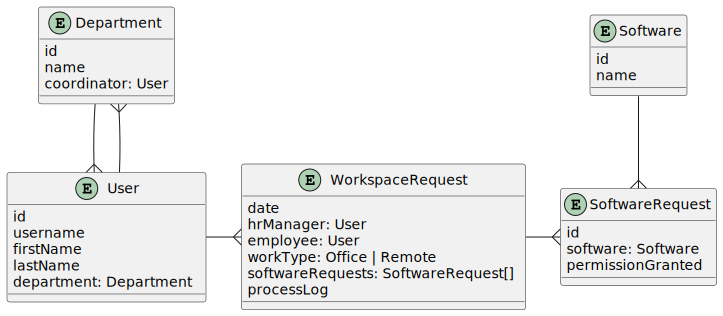

# Jmix Commercial Add-ons Demo

This project includes the following Jmix commercial add-ons:

- [BPM](https://www.jmix.io/marketplace/bpm/)
- [Business Calendars](https://www.jmix.io/marketplace/business-calendars/)
- [Maps](https://www.jmix.io/marketplace/maps/)
- [Notifications](https://www.jmix.io/marketplace/notifications/)
- [WebDAV](https://www.jmix.io/marketplace/webdav/)

## Demo Data

The project contains the data model, UI and BPMN definition demonstrating the process of preparing the workspace for new employees. The process involves functionality of BPM and Notifications add-ons.

The data model consists of the following entities:

When you start the application for the first time, it automatically deploys the `Workspace preparation` process and creates the following users:

- `[admin]` - the standard admin with full rights to the application. However, he cannot start the workspace preparation process.
- `Alice Brown [alice]` - has `HR Manager` role, can start the workspace preparation process and check completed requests.
- `Robert Taylor [bob]` - has `SystemAdministrator` role, can define software systems in the application and grant permissions to them.
- `Linda Evans [linda]` - has `Coordinator` role and is set as coordinator for the `Operations` department. Can allocate physical workspace for new employees working in the office.
- `Susan Baker [susan]` - a new employee. Can only receive notifications about granted permissions and allocated workspace sent to her by the process.

## Demo Scenario

1. Run the application
2. Login as `alice` with password `1`. You are an HR manager and you can start workspace preparation processes.
   1. Open _Application -> Workspace requests_
   2. Click _Start workspace preparation process_ button
   3. Select `susan` in _Employee_ field and `Office` in _Work type_ field
   4. Click _OK_
3. Login as `bob` with password `1`. You are a system administrator and you can grant permissions to software systems.
   1. Open _BPM -> My tasks_
   2. Select `Grant system permissions` in the left panel and double-click the task in the right panel
   3. Create a few software request items in the _Workspace request editor_ window, then click _OK_
4. Login as `linda` with password `1`. You are a coordinator and you can allocate physical workspace for office workers.
   1. Open _BPM -> My tasks_
   2. Select `Allocate workspace` in the left panel and double-click the task in the right panel
   3. Enter a workspace description in the _Allocate workspace_ dialog, then click _Complete task_
5. Login as `alice` again. 
   1. Open _BPM -> My tasks_
   2. Select `Check request` in the left panel and double-click the task in the right panel
   3. Review the _Process log_ field and click _OK_
6. Login as `susan` with password `1`. You are a worker who receives notifications from the process.
   1. Click on the bell icon in the left panel.
   2. Review the notifications.
